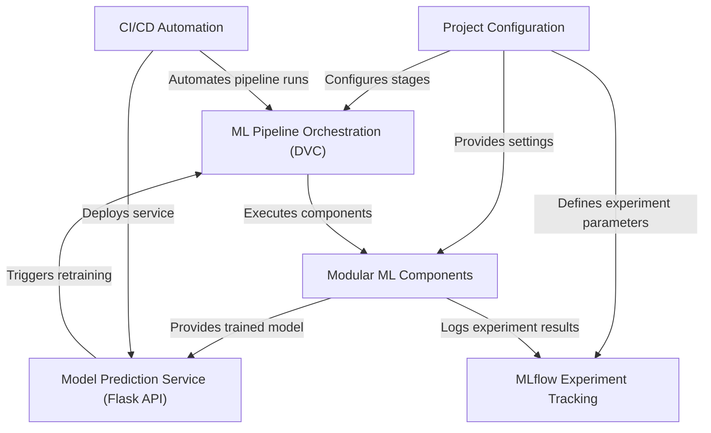

    # Tutorial: Chest-Disease-Classification-from-Chest-CT-Scan-Image

This project creates an **automated system** to detect *chest diseases* from **CT scan images**. It uses a *step-by-step machine learning pipeline* to train a powerful convolutional neural network (CNN) model, which can then be used to make *predictions* accessible via a **web application**. The system is built for *reproducibility*, *easy configuration*, and *automated deployment*.

## Visual Overview

## Chapters

1. [Modular ML Components
](01_modular_ml_components_.md)
2. [Project Configuration
](02_project_configuration_.md)
3. [ML Pipeline Orchestration (DVC)
](03_ml_pipeline_orchestration__dvc__.md)
4. [MLflow Experiment Tracking
](04_mlflow_experiment_tracking_.md)
5. [Model Prediction Service (Flask API)
](05_model_prediction_service__flask_api__.md)
6. [CI/CD Automation
](06_ci_cd_automation_.md)

---

Generated by [AI Codebase Knowledge Builder](https://github.com/The-Pocket/Tutorial-Codebase-Knowledge).

Based on project by Bappy Ahmed